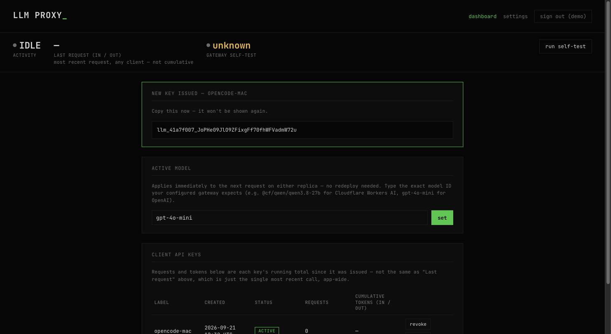
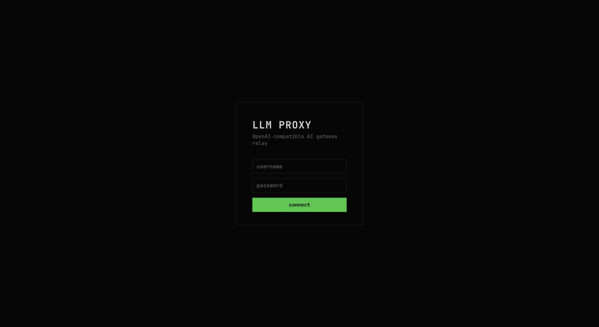
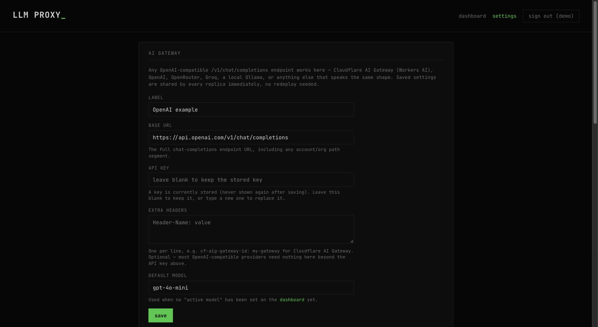

# LLM Proxy

A small, self-hosted relay that makes any OpenAI-compatible AI gateway
(Cloudflare AI Gateway / Workers AI, OpenAI, OpenRouter, Groq, a local
Ollama, or anything else that speaks the `/v1/chat/completions` shape) look
like a single local LLM server to your tools — OpenCode, a chat UI, a
dashboard, whatever already expects an OpenAI-compatible endpoint.

Point your client at `http://your-host:8080` with one of this app's own
issued API keys. The real upstream API key/token lives only in this app's
config — no client ever needs to hold it, and every client key can be
revoked independently without touching the upstream credential at all.

<p align="center">
  
</p>

<details>
<summary>More screenshots (login, settings)</summary>
<br>

| | |
|---|---|
|  Single admin account, signed session cookie |  Any OpenAI-compatible gateway, one config screen — stored keys are never re-echoed back |

</details>

## Why put a relay in front of your AI gateway

- **One place holds the real upstream credential.** Clients get a
  relay-issued key instead — revocable per client, without ever exposing
  the actual provider token.
- **Per-client usage tracking**, not just an app-wide total — see who's
  actually using how many tokens from the `/admin` dashboard or that
  client's own `GET /v1/usage`.
- **A fast local status endpoint** (`/status`) that never calls the
  upstream provider — safe to poll as often as you want from a dashboard
  or status light, at zero cost against your provider's quota.
- **A separate, infrequent self-test** you trigger from the admin GUI (or
  wire up to a cron/CronJob) that actually round-trips through the real
  provider, since that's a real logged/billed request unlike the fast
  status checks.
- **Model switching without redeploying.** Change the active model from
  the admin dashboard; it takes effect on the very next request.
- **Any provider, one config screen.** `/admin/settings` holds the base
  URL, API key, optional extra headers, and default model — swap providers
  without touching code.

## Quick start

### Docker / Podman Compose

Works identically with `docker compose` and `podman-compose` (or Podman
4+'s built-in `podman compose`) — the image is a plain OCI image with
nothing Docker-specific in it, and the non-root user in the Dockerfile
works the same way under Podman's rootless containers.

```bash
git clone <this repo>
cd llm-proxy
cp .env.example .env

# Generate a bcrypt password hash for .env's DASHBOARD_PASSWORD_HASH.
# With a local Python + bcrypt installed:
python3 scripts/hash_password.py
# Or, with no local Python setup at all, using a throwaway container:
docker run --rm -it -v "$(pwd)/scripts:/scripts:ro" python:3.12-slim \
  sh -c "pip install -q bcrypt && python3 /scripts/hash_password.py"

openssl rand -hex 32   # paste into .env's SESSION_SECRET
# edit .env: set DASHBOARD_USERNAME, and either the CF_* or GATEWAY_* block
# (or leave the gateway blank and configure it from the GUI after login)

docker compose up -d        # or: podman-compose up -d
```

Then open `http://localhost:8080/admin`, sign in, and (if you didn't
bootstrap one via `.env`) configure a gateway under **Settings**.

### Plain `docker run` / `podman run`

You'll need your own Redis (the app stores the ACL, active model, gateway
config, and in-flight counter there so multiple replicas can share state).

```bash
docker run -d --name llm-proxy-redis -v llm-proxy-redis-data:/data \
  redis:7-alpine redis-server --appendonly yes

docker build -t llm-proxy .
docker run -d --name llm-proxy -p 8080:8080 --env-file .env \
  -e REDIS_URL=redis://llm-proxy-redis:6379/0 --link llm-proxy-redis \
  llm-proxy
```

(Swap `docker` for `podman` — both commands work unchanged, though
`--link` is deprecated on both; a user-defined network is preferred for
anything beyond quick local testing.)

### Kubernetes

No manifests are bundled here (this app's own production deployment lives
in a private GitOps repo), but the shape is simple: a Deployment for the
app (reads its config from a Secret + `REDIS_URL`), a Service, an Ingress,
and either a single-replica Redis Deployment+PVC or an external Redis you
already run. `/healthz` is a dependency-free liveness/readiness target.

## Configuring an AI gateway

Two ways to get a gateway configured, not mutually exclusive:

1. **`/admin/settings` (recommended for most users).** Sign in, fill in a
   label, the full `/v1/chat/completions` base URL, an API key, optional
   extra headers (one `Header-Name: value` per line), and a default model.
   Saved instantly, shared across all replicas, no restart needed. The
   Settings page includes a table of example configs for common providers.
2. **Env vars, for bootstrapping a fresh install without touching the
   GUI.** Either the `CF_*` vars (Cloudflare Workers AI shortcut) or the
   generic `GATEWAY_*` vars (see `.env.example`) seed the exact same config
   on first boot. Once seeded, `/admin/settings` is the live source of
   truth — the env vars aren't re-read after that, so editing them later
   does nothing until you also update Settings (or clear Redis's
   `gateway_config` key to force a re-seed).

Note: this only works with providers whose API is (or has an option to be)
OpenAI chat-completions-shaped. Anthropic's native Messages API, for
example, isn't — use a provider's OpenAI-compatibility endpoint if it has
one.

## Three separate control planes (deliberately not sharing a mechanism)

1. **SSH** to the host — untouched, unrelated to any of this.
2. **Admin GUI** (`/admin`) — single bcrypt-authenticated account, signed
   session cookie with a sliding idle timeout (default 30 min — any
   activity resets it) and a hard absolute cap (default 12h) that activity
   can't extend. Failed logins are rate-limited per source IP (default: 5
   attempts, then a 15-minute lockout).
3. **LLM-usage ACL** (`/v1/...`) — per-client bearer API keys, issued and
   revoked from the admin GUI, checked before any request is forwarded.

**The admin GUI has no built-in network restriction.** If you expose this
host to the internet, put it behind your own auth/allowlist/VPN as well —
the login rate-limit here is a basic bot deterrent, not a substitute for
network-level access control on an admin panel.

## Endpoints

- `POST /v1/chat/completions`, `GET /v1/models` — OpenAI-compatible,
  requires `Authorization: Bearer <client key>`. Returns `503` if no
  gateway has been configured yet.
- `GET /v1/usage` — requires `Authorization: Bearer <client key>`. Returns
  that key's own cumulative usage (`requests`, `prompt_tokens`,
  `completion_tokens`, `total_tokens`) — self-service only, there's no way
  to ask for another client's numbers. The same per-key totals are also
  shown in the `/admin` dashboard's key table. `/status` (below) still only
  reports app-wide totals, not broken out per client.
- `GET /status` — JSON: activity state (`PROCESSING`/`IDLE`, for a
  dashboard's light-up indicator), last model + token usage, gateway
  self-test result. **Unauthenticated by design** (so it's cheap to poll
  from a dashboard) — if you expose this host publicly, put it behind your
  reverse proxy's own auth if you don't want that state visible.
- `GET /healthz` — liveness/readiness probe target. Doesn't depend on
  Redis or the upstream gateway.
- `GET/POST /admin/...` — the GUI described above.

## Local dev (no containers)

Requires Python 3.10+ (the code uses `X | None` type hints).

```bash
pip install -r requirements.txt
cp .env.example .env   # fill it in, see Quick start above
export $(grep -v '^#' .env | xargs)   # or use python-dotenv / direnv
docker run -d -p 6379:6379 redis:7-alpine   # or podman run
uvicorn app.main:app --reload --port 8080
```

## Testing

```bash
pip install -r requirements-dev.txt
pytest
```

No real Redis or upstream provider needed — tests run against an in-memory
fake Redis (`fakeredis`) and a stubbed `httpx.AsyncClient`, covering the
gateway config (bootstrap-from-env, Settings save semantics), the ACL
lifecycle, session idle/absolute timeout logic, login lockout, and the
proxy's error handling for non-JSON upstream responses.

## Configuration reference

| Variable | Required | Default | Notes |
|---|---|---|---|
| `DASHBOARD_USERNAME` | yes | — | Single admin account. |
| `DASHBOARD_PASSWORD_HASH` | yes | — | bcrypt hash — generate with `scripts/hash_password.py`. |
| `SESSION_SECRET` | yes | — | Random secret for signing session cookies; `openssl rand -hex 32`. |
| `REDIS_URL` | no | `redis://redis:6379/0` | Shared state store. |
| `CF_ACCOUNT_ID`, `CF_API_TOKEN`, `CF_AIG_GATEWAY_ID`, `CF_MODEL` | no | — | Optional Cloudflare Workers AI bootstrap (see above). |
| `GATEWAY_NAME`, `GATEWAY_BASE_URL`, `GATEWAY_API_KEY`, `GATEWAY_EXTRA_HEADERS`, `GATEWAY_DEFAULT_MODEL` | no | — | Optional generic-provider bootstrap (see above). |
| `SESSION_IDLE_MINUTES` | no | `30` | Admin GUI idle sign-out. |
| `SESSION_ABSOLUTE_HOURS` | no | `12` | Admin GUI hard session cap. |
| `LOGIN_MAX_ATTEMPTS` | no | `5` | Failed logins (per source IP) before a lockout. |
| `LOGIN_LOCKOUT_MINUTES` | no | `15` | Lockout duration. |
| `SELFTEST_PROMPT` | no | `Reply with the single word: ok` | Prompt sent by the self-test. |

## CI

`.github/workflows/build-and-publish.yml` runs the test suite on every
push/PR, and builds + publishes a multi-arch (amd64/arm64) image to
GitHub Container Registry on every push to `main` — no secrets setup
needed beyond what GitHub already provides per-repo. Pull the published
image directly:

```bash
docker pull ghcr.io/roobir/llm-proxy:latest
```

## License

MIT — see [LICENSE](LICENSE).
